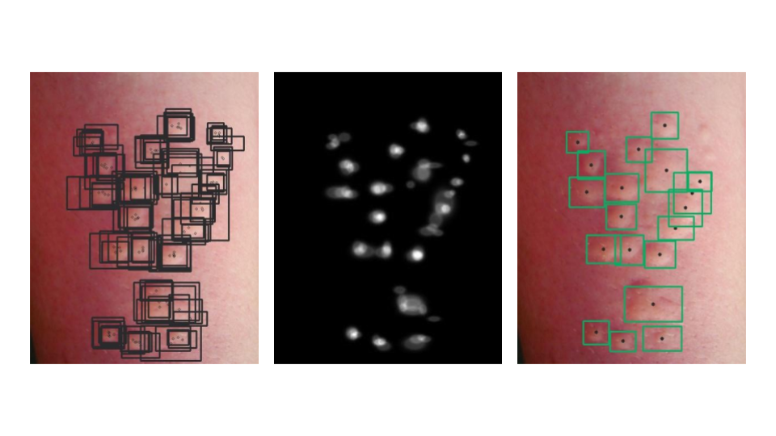

# AUAS: Automatic Urticaria Activity Score

## Table of contents
- [What is AUAS?](#what-is-auas)
- [Datasets](#datasets)
- [Method](#method)
- [Results](#results)
- [The paper](#reference)
- [Contact](#contact)

## [What is AUAS?](https://legit.health/)

Objective, reliable, and precise outcome measures are a prerequisite to evidence-based health care. Regarding the treatment of urticaria, self-reported questionnaires, called PROs (Patient-reported outcome), are the main, if not the only prospective measurement tool and the most accepted way of assessing chronic urticaria and assigning treatment to patients. 

The most commonly used scoring systems are the Urticaria Activity Score (**UAS**) and the version of this scale used for 7 consecutive days (**UAS7**). In summary, UAS and UAS7 rely on **hive counting** and itch severity assessment in order to get the final severity score. In cases with a high number of hives, lesion counting ends up being a very unrewarding task for patients and may result in poor adherence.

Our solution, [AUAS, is a fast, accurate and **fully automatic scoring system** for the severity assessment of urticaria](https://legit.health/auas7-the-best-weapon-in-the-dermatologyst-arsenal/): it automatically detects and counts hives and, combined with the patient-reported itch severity, generates fully reported UAS/UAS7 questionnaires.

## Datasets

Our experiments were run using a dataset of 313 images showing urticaria at different severity levels. Our raw annotation data consisted of annotations by 5 specialists. We are sharing 3 example images with their corresponding annotations so you can start experimenting with the algorithm and see the results by yourself.

## Method

While exploring the data, we observed that, given the potentially huge number of annotations per image, some conventional methods such as naively merging using Intersection Over Union recursively would become intractable. This forced us to come up a more efficient method to combine all clinical annotations faster while trying to be as accurate as possible. We later found a [similar approach by Khudorozhkov et al.](https://ieeexplore.ieee.org/document/8554904)

Our knowledge unification method can be summarised in three stages:

1. **Compute the annotation score for each annotator**: This score tells us how well each person labelled the dataset when compared to the others. Annotators whose labels are very different from the other specialists will get a lower score, whereas those with high concordance will get a higher score. This step can be done at dataset level or at image level.
2. **Compute the weighted Gaussian maps:** Convert every bounding box into a Gaussian distribution centred at the same box center. Once we have all the Gaussian distributions (*maps*) of an image, we overlap all of them into a single map, according to each doctor's annotation score (either local or global). As we are basically overlapping everything, any lesion that was labelled similarly by all doctors will translate into a stronger, more intense Gaussian distribution in the final map. This process is repeated twice in order to create the same map for both box width and height, with the addition of multiplying each Gaussian distribution by its corresponding box width/height. All of the maps are then normalised. This step results in three maps:
	1. **Center map**: a Gaussian map where each point and its actual value correspond to the probability of a bounding box existing at that location.
	2. **Height map**: a Gaussian map where each point and its actual value correspond to the height of a bounding box with its center at that location.
	3. **Width map**: A Gaussian map where each point and its actual value correspond to the width of a bounding box with its center at that location.
3. **Convert map peaks into bounding boxes**: By applying a threshold to the weighted Gaussian center map, we are able to find regions with the highest probability of having a bounding box. For each of these *blobs*, we compute their centroids, which become the center of the final bounding boxes. The width and height of the resulting bounding box are extracted from the height and width map using the coordinates of the blob's centroid.

## Results

Once we had our labels ready, we trained all **YOLOv5** architectures available on our dataset using a **6-fold cross-validation** strategy.

| Model   | Precision (std) | Recall (std) |
|---------|-----------------|--------------|
| yolov5s | 0.66 (0.07)     | 0.57 (0.04)  |
| yolov5m | 0.66 (0.05)     | 0.56 (0.06)  |
| yolov5l | 0.65 (0.04)     | 0.57 (0.06)  |
| yolov5x | 0.65 (0.06)     | 0.56 (0.06)  |

| Model   | Conf_thresh @ IoU | AE_mild | AE_moderate | AE_severe | AE_sum |
|---------|-------------------|---------|-------------|-----------|--------|
| yolov5s | 0.30 @ 0.50       | 3.28    | 8.57        | 8.38      | 20.23  |
| yolov5m | 0.20 @ 0.50       | 3.36    | 8.07        | 11.99     | 23.42  |
| yolov5l | 0.25 @ 0.50       | 3.2     | 8.48        | 13.36     | 25.04  |
| yolov5x | 0.35 @ 0.50       | 3.31    | 10.51       | 17.75     | 31.57  |

## References

- *AUAS: Automatic Urticaria Activity Score using Deep Learning for High Precision Hive Counting* is under review.
- [YOLOv5 official GitHub repository](https://github.com/ultralytics/yolov5)

## Contact

[Alfonso Medela](https://www.linkedin.com/in/alfonsomedela/) \
[Andy Aguilar](https://www.linkedin.com/in/andy-aguilar/) \
[Taig Mac Carthy](https://www.linkedin.com/in/taigmaccarthy/)

